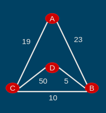

# Solving The Traveling Salesman Problem Using Python

## Objectives:
- Understand the Traveling Salesman Problem (TSP)
- Algorithmic Design
- Data Structures Design
- Documentation

## Notes:
This week we begin implementing the Traveling Salesman Problem...

## Tasks:
### Task #1:
Create a README file...

### Task #2:
Using the graph on slide 9 (now in my noteAssets folder), determine all the circuits and their total cost...

### Task #3:
Design a data structure that holds all the nodes in your graph and all the neighbors and edge weights. NO code!...

### Task #4:
Lastly, create a local GIT Repo...

## Solutions from Node A:

- A > C (19)
- C > B (10)
- C > D (5)
- No possible solution without violating the Nearest Neighbor principle.
- Total possible weight = 34

 <!-- Replace 'graph_image.png' with your actual image file name -->

## Solutions from Node B:

- B > D (5)
- D > C (50)
- C > A (19)
- A > B (23)
- Only possible solution from node B without violating the Nearest Neighbor principle.
- Total weighted score = 97

## Solutions from Node C:

- C > B (10)
- B > D (5)
- No possible solution without breaking the Nearest Neighbor principle.
- Total possible weight = 15

## Solutions from Node D:

- D > B (5)
- B > C (10)
- C > A (19)
- No possible solution without breaking our Nearest Neighbor principle and no repeat visit to a node.
- Total possible weight = 34

## Task #3: Designing the Data Structure

For this task, I've chosen to represent the graph using an adjacency list. In this data structure:
- Each node is associated with a dictionary containing its neighbors as keys and the corresponding edge weights as values.
- This representation allows for efficient access to neighbors and their edge weights.

Example:

```python
graph = {
    'A': {'B': 23, 'C': 19},
    'B': {'A': 23, 'D': 5},
    'C': {'A': 19, 'D': 50},
    'D': {'B': 5, 'C': 50}
}
```

## Task #4: Git Repository Setup

I connected my Replit account with my GitHub account, and the associated GitHub page for this particular repository is:

[GitHub Repository](https://github.com/william-zade/TSP-william-zade)

I will also push my commits to my personal Git repo on my desktop.
Summary of TSP Solver Development
Steps Taken:
1. Initial Setup:

    Defined the graph representing cities and connections with weights.

2. Finding All Paths:

    Implemented find_all_paths function to explore all possible paths in the graph.
    Ensured each node is visited only once and ended at the origin node.
    Considered connection weights to choose the next node.

3. Calculating Total Value:

    Created calculate_total_value function to compute the total connection value for a given path.

4. Finding All Solutions:

    Developed find_all_solutions function to find all possible solutions by exploring paths starting from each node.

5. Printing Solutions:

    Printed all solutions, iterating through the list of solutions and displaying each path with its total connection value.
    Differentiated between viable and non-viable solutions based on the last node in the path.

6. Troubleshooting:

    Identified and fixed issues such as not printing solutions and incorrect formatting.
    Used print statements and logic review to debug the code.

7. Finalizing:

    Refined the code to handle the final leg of travel and print solutions in different colors based on viability.

8. Summary for README:

    Documented the steps taken in this README file for future reference and troubleshooting.

Currently code is non-functional and still needs further debugging. The graph is currently "undefined" as far as the logic is concerned, somehow, and will need addressed.